本书的纹理资源：opengameart.org

## 第二章 渲染流水线

### 2.1 综述：什么是渲染流水线

[别人的笔记，渲染流水线](https://segmentfault.com/a/1190000020767062)

《Render-Time Rendering》中的渲染流程

1. 应用阶段：由应用主导，通常由CPU负责实现，开发者包含3个主要任务，最重要的输出是渲染所需的几何信息，及**渲染图元（rendering primitives，比如一个三角形）**
   * 准备好场景数据：摄像机位置，视椎体，模型，光源等等。
   * 粗粒度剔除：把不可见的物体剔除出去。
   * 设置模型的渲染状态：使用的材质(漫反射颜色，高光反射颜色等)，纹理，shader等。
2. 几何阶段：处理所有和我们要绘制的几何先关的事情，这一阶段通常在GPU上进行。
   * 负责和每个渲染图元打交道，进行逐顶点，逐多边形的操作。
   * 把顶点坐标变换到屏幕空间。
   * 对输入的渲染图元进行多步处理，最终输出屏幕空间的二维顶点坐标，顶点的深度值，着色等。
3. 光栅化阶段：使用上个阶段传递的数据产生屏幕上的像素，并渲染处最终的图像。
   * 决定每个渲染图元中的哪些像素应该被绘制。
   * 对上一个阶段得到的逐顶点数据(如纹理坐标，顶点颜色等)进行插值，然后在进行逐像素处理。

### 2.2 CPU和GPU之间的通信

**阶段：**渲染流水线的起点是CPU，即应用阶段，大致分为三个小阶段

1. 把数据加载到显存中。渲染所需的数据  硬盘--->系统内存--->显存
2. 设置渲染状态
3. 调用draw call

**渲染状态：**这些状态定义了场景中的网格时怎样被渲染的。比如使用那个顶点着色器，光源属性，材质，纹理等。其实类似于一个对象实例，里面包含了渲染某个网格需要的所有属性。

**调用Draw Call**

1. CPU准备好渲染状态后，就需要调用一个渲染命令来通知GPU渲染。
2. drawcall命令仅仅指向一个需要被渲染的图元列表。不再包含材质信息（因为上面第一步就把数据加载到显存中了）。
3. 给定一个Drawcall后，GPU就会根据渲染状态(例如材质，纹理)和所有输入的顶点数据进行计算，最终输出像素。这个计算过程就是**GPU流水线。**

### 2.3 GPU流水线

定义：GPU得到渲染命令后，将图元渲染到屏的一系列流水操作。

流水线阶段：

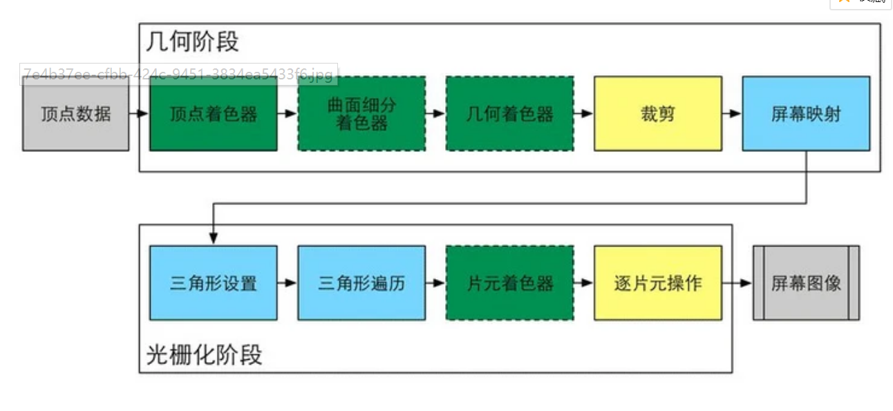

#### 2.3.2 顶点着色器：几何阶段开始

GPU在每个输入的网格顶点上都会调用顶点着色器。

1. 流水线的第一个阶段。
2. 顶点着色器本身不可以创建或销毁任何顶点，无法得到顶点与顶点之间的关系
3. 顶点相互独立，GPU可以并行处理每一个顶点。
4. 主要工作：坐标变换和逐顶点光照，输出后续阶段所需的数据

坐标变换：

1. 对顶点的坐标进行某种变换。
2. 把顶点坐标从模型空间转换到齐次裁剪空间（NDC，normalized device coordinates，归一化的设备坐标）。
3. 顶点着色器可以在这一步改变顶点的位置，这在顶点动画中非常有用。
4. 通过改变位置可以模拟水面、布料等。

#### 2.3.3 裁剪

用来实现不在摄像机视野范围内的物体不需要传递下去的方式。

一个图元和摄像机视野的关系：

1. 完全在视野内：继续传递给下一个流水线阶段
2. 完全在视野外：直接丢弃，不传递。
3. 部分在视野内：使用裁剪进行处理。在视野外部的顶点使用一个新的顶点，位于内部顶点外部顶点连线与视野边界交点。这部分基于上一步得到的NDC坐标来处理

#### 2.3.4 屏幕映射

输入：仍然是三维坐标系下的坐标（范围在单位立方体内）。

任务：把每个图元的x和y坐标转换到屏幕坐标系(和显示画面的分辨率有很大关系，坐标范围-1到1)下。这个过程实际上是一个缩放过程。

窗口坐标系：屏幕坐标系和z坐标一起构成了一个坐标系。这些值会一起被传递到光栅化阶段。

#### 2.3.5 三角形设置：光栅化开始

**光珊化阶段**任务：1. 计算每个图元覆盖了哪些像素，2. 为这些像素计算它们的颜色。

输入：屏幕坐标系下的顶点位置以及额外信息，如深度值(z坐标)、法线方向、视角方向。

任务也是定义：计算光栅化一个三角网格所需的信息，得到一个三角形网格表示数据的过程。

#### 2.3.6 三角形遍历

定义：也称为扫描变换，主要是检查每个像素是否被一个三角网格所覆盖，如果被覆盖，就会生成一个片元。这个过程叫三角形遍历。

插值：使用三角网格3个顶点的顶点信息对覆盖区域的箱数进行插值。

输出：片元序列。一个片元不是真正意义上的像素，而是包含了很多状态(屏幕坐标，深度信息等)的集合，这些状态用于计算每个像素的最终颜色。

#### 2.3.7 片元着色器

这个阶段可以完成很多重要的渲染技术。其中之一是纹理采样。根据顶点着色器输出的每个顶点对应的纹理坐标，和光栅化(这里应该就是指三角形设置和遍历阶段)对三角网格顶点对应的纹理坐标插值，就可以得到其覆盖的片元的纹理坐标了。

#### 2.3.8 逐片元操作

渲染流水线最后一步，在DirectX中称为输出输出合并阶段。这个阶段不可编程，但可高度配置。

任务：1.经过各种测试，深度，模板测试，决定每个片元的可见性。2.将片元的颜色与缓冲区的进行混合。

模板测试：可以开启或不开启

1. 比较模板缓冲。通过比较来判断是否通过模板测试。比较函数可指定
2. 修改模板缓冲，测试完成后，可以指定修改模板缓冲的操作，比如保持不变或将对应值加1.

深度测试：可以开启或不开启

1. 比较深度缓冲。决定丢弃或保留
2. 片元只有通过深度测试才能修改深度缓冲。

混合（Blend）：可以开启或不开启，只有通过所有测试才能到达这一步

1. 关闭混合：则新的颜色值直接覆盖颜色缓冲区的像素值
2. 开启混合：进行混合（透明效果就需要开启混合）。
3. 混合函数：和透明通道嘻嘻相关，比如根据透明通道的值进行相加，相减，相乘等。

提前测试：

1. Early-z技术：将深度测试提前到片元着色器之前，减少不必要的计算。Unity里面就是
2. 片元着色器的透明度测试与测试提前的冲突  ？？？？

双重缓冲：

1. 避免屏幕显示哪些正在光栅化的图元。
2. 后置缓冲：当前帧渲染过程的缓冲，场景的渲染在幕后发生。
3. 前置缓冲：屏幕用来显示的缓冲。
4. 后置缓冲渲染完毕，GPU就会交换后置缓冲与前置缓冲的内容。

### 2.4 一些容易困惑的地方

#### 2.4.1 OpenGL/DirectX 

1. 这两个都是图像应用编程接口：封装了寄存器，显存等硬件的操作。
2. 这两个实际上都是一个标准，一个规范，定义了一个跨编程语言、跨平台的编程接口的标准，并不是一个API库。
3. 
4. 参考：[OpenGL底层实现原理](https://blog.csdn.net/qq_23034515/article/details/108132191)
5. 这些接口相当于上层应用程序和底层GPU的桥梁。
6. 显卡驱动：真正知道如何和GPU通信，把OpenGL或DirectX的函数翻译成GPU能够听懂的语言，也负责把纹理等数据转换成GPU所支持的格式。可以理解为显卡的操作系统
7. 应用程序发送命令 --->  图形接口   --->   显卡驱动
8. 一个显卡制作商为了让他们的显卡可以同时和OpenG2L、DirectX合作，就必须提供支持两种接口的显卡驱动。
9. 

#### 2.4.2 什么是 HLSL、GLSL、CG

都是着色语言，最终都会被编译成与机器无关的会变语言，也被称为中间语言，这些中间语言再交给显卡驱动来翻译成真正的机器语言，即GPU可以理解的语言。

HLSL：DirectX的着色语言，有微软控制着色器的编译，支持HLSL的平台有限，几乎全是微软自己的产品（windows，Xbox 360 、PS3等），因为其他平台没有可以编译HLSL的编译器。

GLSL：OpenGL的着色语言，跨平台，因为OPenGL没有提供着色器编译器，而是由显卡驱动来完成编译。也就是说，只要显卡驱动支持对GLSL的编译他就可以运行。也就是说，GLSL是依赖硬件，而非操作系统层级的。

CG：NVIDIA开发的语言，真正的跨平台，他会根据平台的不同，编译成相应的中间语言。现在已经不在维护。

#### 2.4.3 什么是DrawCall

drawcall就是CPU调用图像编程接口，如OpenGL中的glDrawElements或者DirectX中的DrawIndexedPrimitive命令。

问题1：CPU和GPU是如何实现并行工作的？

1. 命令缓冲区：包含一个命令队列，Cpu添加命令，GPU读取并执行命令。
2. 命令的种类：有很多，DrawCall，改变渲染状态(改变使用的着色器，使用不同的纹理等)等。
3. 

问题2：为什么DrawCall多个会影响帧率？

1. 拷贝文件举例：拷贝10000个1kb的文件比拷贝1个10MB慢很多，因为拷贝操作本身需要很多额外的性能开销。所以拷贝数量多了，开销将会很大。
2. 每次调用Drawcall之前，CPU需要想GPU发送很多内容，包括数据，状态命令等，CPU需要完成很多工作，而GPU的渲染能力是很强的，所以渲染速度快于cpu提交命令的速度。**GPU处于空闲，帧率降低。所以本质上是CPU在拖后腿。**

问题3：如何减少Draw Call？

1. 方法有很多，这里仅讨论使用批处理。
2. 批处理思想：提交大量很多小的DrawCall会造成CPU性能瓶颈，即CPU把时间都花费在准备DrawCall的工作上了。所以把很多小的DrawCall合并成一个大的DrawCall。
3. 批处理需要在CPU的内存中合并网格，合并过程是需要消耗时间的。所以批处理技术更适用于那些静态的物体，那些物体仅需要合并一次。动态物体也可以，但是每一帧都要重新计算并合并。
4. 游戏开发中，1.避免使用大量很小的网格，不可避免时，考虑合并  2.避免过多的材质，尽量在不同的网格之间公用一个材质，因为相同材质的物体只有顶点数据不同，因此Unity可以合并进行批处理。
5. [Unity动态批处理和静态批处理](https://www.cnblogs.com/MuniuTian/p/10865276.html)

#### 2.4.4 什么是固定管线渲染

1. **固定函数的流水线**，也简称固定管线，通常指在较旧的GPU上实现的渲染流水线。
2. 只提供一些配置操作。可配置的管线，就好像控制电路上的多个开关，我们可以选择打开或者关闭一个开关。
3. 现在固定管线逐渐退出历史舞台，而是使用可编程的管线。

### 2.5 那么你明白什么是Shader了吗

1. Gpu流水线上一些可高度编程的阶段，而由着色器编译出来的最终代码是在GPU上运行的
2. 有一些特定类型的着色器：顶点着色器，片元着色器等。
3. 依靠着色器可以控制流水线中的渲染细节。

## 第3章 Unity Shader基础

### 3.1 概述

#### 3.1.1 材质和shader

1. shader 定义了渲染所需的各种代码（顶点着色器和片元着色器）、属性（如使用了哪些纹理）和指令（渲染和标签设置等）。
2. 材质允许我们调节这些属性，并将其最终赋给相应的模型。

#### 3.1.3 UnityShader

创建Shader

1. Standard Surface Shader：产生一个包含了标准光照模型的表面着色器模板
2. Unlit Shader ：产生一个不包含光照（但包含雾效）的基本的顶点/片元着色器
3. Image Effect Shader：实现各种屏幕后处理效果提供一个模板
4. Compute Shader：产生一种特殊的shader文件，旨在利用GPU的并行性来进行一些与常规渲染流水线无关的计算。

Shader导入面板：进行导入设置

1. Default Maps：可以指定shader使用的默认纹理，任何材质球第一次使用shader时，都会自动关联这个纹理。
2. 一些基本信息：是否是表面着色器等
3. 标签设置相关：是否会投射阴影。使用的渲染队列，lod值等。

### 3.2 ShaderLab

计算机学中的任何问题都可以通过增加一层抽象来解决  ----大卫.惠勒

定义：

1. ShaderLab是Unity为开发者提供的高层及的渲染抽象层。是Unity提供的编写UnityShader的一种说明性语言。

2. 

3. ShaderLab使用了一些嵌套在花括号内部的语义来描述一个UnityShader文件的结构。包含了许多渲染所需的数据。

4. 基本结构

   

### 3.3 Unity Shader 的结构

#### 3.3.1 Shader的名字

   在Unity Shader的第一行，用过Shader 语义来指定名字，选择shader使用时就显示这个名字。

#### 3.3.2 材质和UnityShader的桥梁：Properties

1. Properties语块中定义了一系列属性，这些属性将会出现在材质面板中
2. 语义块定义：
3. 属性类型：
4. 例子：
5. 属性的访问：需要在CG代码片中定义和这些属性类型相匹配的变量。但是即使我们不在Properties中声明这些属性，也可以在CG代码中定义变量。此时可以通过脚本向Shader中传递这些属性。

#### 3.3.3 Sub Shader

**概述：**

1. 定义：一个Sub Shader表示这个着色器的一种实现，加载Shader时，Unity会扫描所有的SubShader语义块，然后选择第一个能够在目标平台上运行的SubShader，如果都不支持，会使用Fallback指定的。
2. 原因：不同显卡具有不同能力，所以希望在旧的显卡上使用复杂的较低的着色器，而在高级显卡上使用计算复杂度较高的着色器。
3. 语义块：
4. Pass：一个Pass定义了一次完整的渲染流程，pass数目过多，会造成渲染性能下降。

**状态设置：**

1. ShaderLab提供了一系列渲染状态的设置指令，这些指令可以设置显卡的各种状态。
2. 在SubShader中设置了状态时，会应用到所有的Pass。也可以在Pass中单独进行设置
3. 常见的渲染状态设置：

**SubShader标签：**

1. 标签（Tags）是一个键值对，键和值都是字符串类型。
2. 用来告诉渲染引擎：所在SubShader希望怎样以及何时渲染这个对象 ？？？？有点抽象
3. 结构：
4. 标签类型：这些标签仅可以在SubShader中声明，而不能再Pass中使用。因为标签类型不同

**Pass语义块：**

1. 包含的语义：
2. 名字：
3. 使用名称：
4. 设置渲染状态：SubShader的状态设置使用于Pass。Pass中还可以使用固定管线的着色器命令。
5. Pass中的标签：不同于Subshader
6. 特殊的Pass，以便进行代码复用或实现更复杂的效果
   * UsePass：如上面提到的，使用该命令来复用其他Unity Shader的Pass
   * GrabPass：该Pass负责抓取屏幕并将结果存储在一张纹理中，以便用于后续的Pass处理。

#### 3.3.4 Fallback

1. 紧跟在SubShader语义块后面。如果所有的SubShader在这显卡上都不能运行，就使用这个。
2. 
3. 

### 3.4 Unity Shader的形式

着色器的代码，可以写在SubShader语义块(表面着色器)中，也可以写在Pass语义块中(顶点\片元着色器)。

着色器代码的位置：

#### 3.4.1 表面着色器

1. Unity自己创作的一种着色器代码类型，可以理解为Unity对顶点\片元着色器的更高一层的抽象。
2. 本质上和顶点\片元着色器是一样的，Unity在背后仍旧把它转换成对应的顶点\片元着色器。
3. Unity为我们处理了很多光照细节。
4. 实例：
5. 代码在CGPROGRAM和ENDCG之间，使用CG\HLSL(经Unity封装后的，和标准的有细微的不同)编写。
6. 表面着色器不需要关系有多少个Pass、每个Pass如何渲染，Unity会在背后做好这些事。

#### 3.4.2 顶点\片元着色器

1. 也需要定义在CGPROGRAM和ENDCG之间
2. 写在Pass语义块内，而非SubShader内，原因是，每个Pass需要自定义需要使用的Shader代码。

#### 3.4.3 固定函数着色器

1. 对于一些旧的，不支持可编程管线着色器的设备(其GPU仅支持DirectX 7.0、OpenGL 1.5)使用。
2. 实例：
3. 被定义在Pass语义块中，但只是一些渲染设置。
4. 这种管线的编程方式已经逐渐被抛弃。

#### 3.4.4 选择哪种Unity Shader形式

1. 除非有明确需求必须使用固定函数着色器，否则使用可编程
2. 需要和各种光源打交道，使用表面着色器，但需要小心在移动平台的性能表现。
3. 需要的光照数目少，使用顶点\片元着色器。
4. 有很多自定义的渲染效果，选择顶点\片元着色器。

### 3.6 答疑解惑

#### 3.6.1 Unity Shader != 真正的Shader

1. Unity Shader中，可以在同一个文件包含需要的顶点着色器和片元着色器代码。
2. Unity Shader中，可以通过一行特定的指令完成一些渲染设置（开启混合、深度测试等）
3. Unity Shader中，可以在特定语句块声明一些属性，依靠材质来方便地改变这些属性，还提供了模型自带数据的访问方法，不需要开发者自行编码来传给着色器
4. Unity Shader中，可以编写的Shader类型和语法都被限制了。

#### 3.6.2 Unity Shader 和 CG\HLSL之间的关系

1. Unity会把CG片段编译成低级语言，如汇编语言等，在导入设置面板上可以查看。
2. 本质上Unity中只存在顶点\片元着色器。
3. Unity会使用不同的编译器把CG片段编译到所有平台，这样切换平台时不用再重新编译。
4. 使用GLSL：代码需要嵌套在GLSLPROGRAM和ENDGLSL之间。用这个意味着发布的目标平台只有MAC OS X、OpenGL ES 2.0或者Linux，而对于PC、Xbox这样仅支持DirectX的平台来说，就相当于放弃了。

### 3.7 扩展阅读

1. [Unity官方文档Manual](http:/docs.unity3d.com/Manual/SL-Reference.html)
2. [NVIDIA提供的CG文档](http://http.developer.nvidia.com/CG/)

## 第4章 学习Shader所需的数学基础

### 4.2 笛卡尔坐标系

1. 左右手坐标系：

2. 二维坐标系没有左右之分，因为总是可以通过渲染达到一致。
3. 旋转正方向
4. Unity的模型空间使用的是左手坐标系
5. Unity的摄像机观察空间使用的是右手坐标系：
6. 练习题：观察空间下，球体坐标为（0,0,-10）,摄像机的模型空间(相当于以摄像机为坐标原点)下(0,0,10)。   前提是：两种坐标系X轴朝向相同。

### 4.3 点和矢量

向量在游戏开发中的应用：[1](https://www.cnblogs.com/davidsheh/p/5246213.html)，[2](https://www.cnblogs.com/davidsheh/p/5353304.html),   [3](https://www.cnblogs.com/davidsheh/p/5370325.html)

点：表示n维空间的一个位置。

矢量：指n维空间中一种包含了模(magnitude)和方向的有向线段。比如速度（这辆车的速度是向南80km/h,向南表示方向，80km/h表示模），通常被用于表示相对于某个点的偏移。

标量：只有模，没有方向。

#### 4.3.1 点和矢量的区别

总结：点是一个没有大小之分的空间中的位置，而矢量是一个有模和方向但没有位置的量。

1. 表示偏移时：矢量的尾是一个位置，那么矢量的头就可以表示另一个位置了。此时两个点相减就是这个矢量，也就是偏移。
2. 但一个矢量的尾固定在坐标系原点，那么这个矢量的表示就和点的表示重合。
3. 因此也可以说，任何一个点都可以表示成一个从原点出发的矢量。
4. 后续将用于表示方向的矢量称为方向矢量。

#### 4.3.2 矢量运算

**矢量和标量的乘除法**

1. 乘法,只需要把矢量的每个分量和标量相乘：
2. 除法：把矢量的每个分量除以标量：
3. 乘法，矢量和标量的位置可以互换，而除法，只能是矢量被标量除，反之则是没有意义。

**矢量的加法和减法**

1. 就是每个标量相加或者相减：
2. 加法的几何意义：相当于从一个起点进行了一个偏移位置a，然后进行了一个位置偏移b，相当于进行了一个a+b的位置偏移。
3. 减法：a-b相当于是a点到b点的位移。得到的矢量求模就算出了a到b的距离。
4. 加减法图示：

**矢量的模**

1. 表示：在矢量两旁分别加上一条垂直线。
2. 对于二维定理：其实就是使用了勾股定理。斜边的长度就是矢量的模。所以代码里面一些比较时都不直接比较模，因为要开平方。

**单位矢量**

1. 单位矢量指：模为1的矢量，也称为被归一化的矢量(normalized vector)。过程就叫归一化。
2. 给定任何非零矢量v，可以计算单位矢量。
3. 从二维空间来说，画一个单位圆，单位矢量就是所有从圆心触发，到达球面的矢量。

**矢量的点积**：内积

1. 表示，公式一：
2. 几何意义：投影，当a是单位矢量时，a.b 就是 b在a方向上的有符号的投影，有可能是负数，如果a和b的方向相反(夹角大于90)，那么结果就小于0.
3. 矢量的点积满足交换律：a.b = b.a
4. 矢量的点积可结合矢量的加法和减法。
5. 矢量和本身进行点积的结果，是该矢量的模的平方。
6. 对点积中其中一个矢量进行缩放的结果，相当于对最后的点积结果进行缩放。
7. 投影根据夹角的符号：
8. 公式2：a和b点积与夹角的关系，
9. 根据点积计算夹角：

**矢量的叉积**：外积

1. 叉积运算公式：
2. 不满足交换律，满足反交换律：a x b = -（b x a）
3. 不满足结合律：(a×b)×c ≠ a×(b×c)
4. 几何意义：两个矢量的叉积的结果，是一个同时垂直于这两个矢量的新矢量。
5. 新矢量的模：|a×b| = |a||b|sinθ   ，这和计算四边形的面积是一样的
6. 四边形面积(底*高)：A = |b|h = |b|(|a|sinθ) = |a||b|sinθ = |a×b|
7. a X b 得到 0向量。模为0.
8. 叉积常见的一个应用：计算垂直于一个平面、三角形的矢量。也可以用于判断三角面片的朝向。

### 4.4 矩阵

#### 4.4.1 描述

英文名：matrix，在三维数学中，通常使用矩阵来进行变换，一个矩阵可以把一个矢量从一个坐标空间转换到另一个坐标空间。比如顶点着色器，需要把顶点坐标从模型空间变换到齐次裁剪坐标系。

矩阵是由m X n个标量组成的长方形数组。有行和列之分。

列矩阵：n X 1 的矩阵  ， 行矩阵：1 X n的行矩阵。

#### 4.4.3 矩阵运算

**矩阵和标量的乘法**

1. 矩阵的每个元素和标量相乘。

**矩阵和矩阵的乘法**

1. 结果：是一个新的矩阵。
2. 可以相乘的前提条件：第一个矩阵的列数必须和第二个矩阵的行数相同。
3. 一个r X n的矩阵和一个 n X c 的矩阵相乘，结果是一个 r X c大小的矩阵。
4. 计算公式：Cij 表示结果矩阵的某一个元素，就是A中的第i行和B中的第j列，把他们对应的元素相乘后，再加起来：
5. 不满足交换律。
6. 满足结合律

**特殊矩阵**

1. 方块矩阵：简称方阵，指那些行和列数目相等的矩阵。方阵的**对角元素**是指行号和列号相等的元素。如果一个矩阵除了对角元素外的元素都为0，那么这个矩阵叫**对角矩阵**。
2. 单位矩阵：对角元素都为1的对角矩阵叫做单位矩阵
3. 转置矩阵，即转置运算。一个矩阵的转置矩阵表示为：原矩阵的第i行变成第j列，第j列变成第i行。数学公式：
4. 逆矩阵：方阵 x 方阵的逆矩阵  将会得到一个单位矩阵。
   * 并非所有矩阵都有对应的逆矩阵。
   * 如果一个矩阵有对应的逆矩阵，则这个矩阵是可逆的，或者非奇异的。
   * 一个矩阵是否可逆：如果一个矩阵的**行列式**不为0，那么他就是可逆的。
   * 性质一：逆矩阵的逆矩阵就是原矩阵本身。
   * 性质二：单位矩阵的逆矩阵是它本身。
   * 性质三：转置矩阵的逆矩阵是逆矩阵的转置。
   * 性质四：矩阵串接相乘后的逆矩阵等于反向串接各个矩阵的逆矩阵。
   * 逆矩阵的几何意义：一个矩阵表示一个变换，而逆矩阵允许我们还原这个变换。比如使用变换矩阵M对矢量v进行一次变换，然后在使用他的逆矩阵M-1进行另一次变换，那么我们会得到原来的矢量。
5. 正交矩阵：如果一个方阵M和他的**转置矩阵**的乘积是单位矩阵的话，我们就说这个矩阵是正交的。

#### 4.4.5 行矩阵还是列矩阵

1. 矢量表示为行矩阵或者列矩阵去乘以另一个矩阵M，得到的结果是不同的。
2. 在Unity中，常规做法是把矢量方阵矩阵的右侧，即把矢量转换成列矩阵来进行运算。矩阵乘法通常都是右乘。
3. ？？？？？

### 4.5 矩阵的几何意义：变换

#### 4.5.1 什么是变换

1. 指把一些数据，如点、方向矢量甚至是颜色等，通过某种方式进行转换的过程。
2. 后面就是将怎么使用一个矩阵乘法，来表示一个矢量(转换成四维矢量，也是一个列矩阵)进行平移旋转缩放这些变换。

**线性变换：**

1. 指那些可以保留矢量加和标量乘的变换。
2. 数学公式表示：
3. 缩放，旋转、错切、镜像、正交投影等都是线性变换。
4. 对一个三维矢量进行线性变换，那么一个3X3的矩阵就可以表示所有的线性变换。

**平移变换：**例如 f(x) = x + (1,2,3)

**仿射变换：**

1. 合并线性变换和平移变换的变换类型
2. 可以使用一个4X4的矩阵来表示，为此，需要把矢量扩展到思维空间下，这就是齐次坐标空间。

#### 4.5.2 齐次坐标

由于要使用4X4的矩阵来表示平移操作。所以也要把原来的三维矢量转换成四维矢量，也就是齐次坐标（这里齐次坐标将泛指四维齐次坐标）。

**三维转换四维：**

1. 对于一个点：把其w分量设为1.  所以对一个点进行变换时，平移、旋转、缩放都会施加于该点。
2. 对于方向矢量：把其w分量设为0. 所以对一个方向矢量变换时，平移的效果会被忽略

#### 4.5.3 分解基础变换矩阵

1. 可以使用一个4x4矩阵来表示平移旋转和缩放。
2. 把表示纯平移、纯旋转、纯缩放的变换矩阵叫做基础变换矩阵。
3. 共同点，可以把一个基础变换矩阵分解成4个组成部分：
4. M3x3用于表示旋转和缩放。
5. T3x1用于表示平移
6. 01x3是零矩阵，即 = [0 0 0]
7. 右下角的元素就是标量1

#### 4.5.4 平移矩阵

#### 4.5.5 缩放矩阵

#### 4.5.6 旋转矩阵

#### 4.5.7 复合矩阵

1. 
2. 约定变换的顺序是先缩放，在旋转，最后平移，因为矩阵的乘法不满足交换律，因此不同的乘法顺序得到的结果不一样。

### 4.6 坐标空间

#### 4.6.1 为什么使用这么多坐标系

因为一些概念只有在特定的坐标空间下才有意义，才更容易理解。

#### 4.6.2 坐标空间的变换

1. 定义一个坐标空间，必须指明其原点位置和3个坐标轴的方向。而这些数值实际上是相对于另一个坐标空间。
2. 所有空间都是相对的。
3. 坐标空间会形成一个层次结构，每个坐标空间都是另一个坐标空间的子空间，反过来，每个空间都有一个父空间，坐标空间的变换实际上就是在父空间和子空间之间对点和矢量进行变换。
4. 变换公式：
5. 转换：
6. 上诉把最后那个公式进行一些推到就就得到了一个父子空间之间转换的矩阵。其实和数学公式差不多，就通过基本概念(这里是原点的移动)，设x，设y得出一个基本公式，然后一推导。

#### 4.6.3 顶点的坐标空间变换过程

从模型空间，最后变换到屏幕空间得到真正的屏幕像素坐标的空间变换过程。

例子：农场游戏中，妞妞的鼻子是怎么被画到屏幕上的。

#### 4.6.4 模型空间

1. 也称为对象空间或局部空间。
2. 模型空间中的方向概念，“前(forward)”、“后(back)”、"上(up)"等，称为自然方向。
3. Unity在模型空间中使用的是左手坐标系，因此+x轴，+y轴，+z轴分别对应模型的右、上、前。
4. 假设妞妞的鼻子的模型空间的位置是(0,2,4),齐次坐标下的表示为(0,2,4,1). w分量为1，因为是点。

#### 4.6.5 世界空间

1. 建立了我们所关系的最大的空间。在农场游戏中，农场就是世界空间。我们不关心农场在哪儿，因为在游戏中，农场就是最大的空间概念。
2. 世界空间可以用于描述绝对位置。绝对位置是指在世界坐标系中的位置。
3. Unity中，世界坐标同样使用了左手坐标系。
4. 模型变换：将模型空间变换到世界空间。
5. 根据妞妞根节点的参数，可以得到妞妞的在世界坐标中的缩放，旋转和平移，就可以得出模型至世界的变换矩阵，然后带入鼻子的模型空间的坐标，就可以计算出鼻子的世界空间坐标。
6. Unity中应该有接口可以获取这个矩阵，或者接口可以直接算出来坐标。

#### 4.6.6 观察空间

1. 也称为摄像机空间。观察空间可以认为是模型空间的一个特例---在所有的模型中有一个非常特殊的模型，即摄像机。
2. 观察空间中，摄像机位于原点，坐标轴的选择可以是任意的。unity中，+x指右方，+y指上方，+z指后方（之前的模型空间和世界空间的+z都是指前方，因为之前的都是左手坐标系，而观察空间使用的是右手坐标系。这是符合OpenGL传统的）。
3. 左右手坐标系的差异，很少对我们编程造成影响，因为Unity做了很多底层工作，包括坐标转换，但是如果自行使用Camera.cameraToWorldMartix等接口就需要小心这些差异。
4. 世界空间到观察空间的变换叫做观察变换。
5. 方法一：使用4.6.2节的方法，构建从观察变换到世界的变换矩阵，在求逆矩阵。就可以拿到世界至观察矩阵
6. 方法二：想象平移整个观察空间，让摄像机原点位于世界坐标的原点，坐标轴与世界空间中坐标轴重合，这样就直接得到了世界至观察矩阵。、

#### 4.6.7 裁剪空间

1. 从观察空间转换到裁剪空间（也叫齐次裁剪空间）中的矩阵叫做裁剪矩阵，也叫投影矩阵。
2. 裁剪空间的目标是方便地对渲染图元进行裁剪，这块空间是有视椎体决定的。
3. 视椎体是空间中的一块区域，由六个平面包围，这些平面称为裁剪平面。视椎体有两种类型，涉及两种投影方式，正交投影和透视投影。
4. 投影矩阵有两个目的
   * 为投影做准备，这里没有进行真正的投影工作，而只是准备，真正的投影发生在后面的齐次出除法中。
   * 对x、y、z分量进行缩放。直接使用视椎体的6个裁剪平面来进行裁剪会比较麻烦，而经过投影矩阵的缩放后，可以直接使用w分量作为一个范围值，如果x、y、z分量都位于这个范围内，则该顶点位于裁剪空间内

**透视投影**

**正交投影**

#### 4.6.8 屏幕空间

经过投影矩阵的变换后，我们可以进行裁剪操作，裁剪工作完成后，就进行真正的投影，即把视椎体投影到屏幕空间。这一步将得到像素位置。

**齐次除法**(homogeneous division),也称为透视除法，就是使用w分量去除以x、y、z分量。OpenGL中这一步得到的坐标叫归一化的设备坐标(Normalized Device Coordinates，NDC)。经过这一步坐标就变换到一个立方体内。范围是[-1,1]。而对于正交投影，这一步之后没有变化，因为正交投影的视椎体本来就是一个立方体。

**长方体映射屏幕**：clip->裁剪空间的坐标。pixelWidth指屏幕像素宽度。

#### 4.6.9 总结

下图总结了一个顶点如何从模型空间变换到屏幕坐标的过程。

### 4.7 法线变换

法线也被称为法矢量。是模型的一个顶点携带的额外信息的一种。变换模型时，不仅需要变换顶点，也需要变换顶点法线。

切线也被称为法矢量，也是额外信息的一种，通常与纹理空间对齐，与法线方向垂直。

法线的顶点变换，由于需要与切线保持垂直，所以需要一些特殊的处理。

### 4.8 Unity Shader的内置变量

Unity提供了很多内置参数，我们不在需要自己手动计算一些值，这些变量可以在UnityShaderVariables.cginc文件中找到定义和说明。

#### 4.8.1 变换矩阵 Unity5.2

#### 4.8.2 摄像机和屏幕参数

Unity提供了一些内置变量来让我们访问当前正在渲染的摄像机的参数信息。

### 4.9 答疑解惑

## 第五章 开始Unity Shader学习之旅

### 5.2 一个简单的顶点/片元着色器

1. 指定着色器函数：#pragma vertex vert：片元着色器的函数代码在ver方法中。
2. 着色器的函数声明不仅要指定输入输出的数据类型(float4等)，还要指定输入输出的数据意义(比如POSITION：模型空间顶点位置   SV_POSITION:裁剪空间顶点位置)
3. 输入输出的参数也可以定义一个结构体，实现多参数输入与输出，结构体内部的变量同样声明数据类型和数据意义即可。
4. Unity支持的语义有：POSITION,TANGENT,NORMAL,TEXCOORD0,TEXCOORD1,TEXCOORD2,COLOR等。
5. 上诉语义确定的数据来源：一些是由Mesh Render提供的。调用Draw Call的时候，MeshRender会把它负责渲染的模型数据发送给Unity Shader。
6. 顶点着色器与片元着色器的通信，定义一个结构体作为顶点着色器的输出，片元着色器的输入，里面定义一个color，在顶点着色器中设置，那么在片元着色器中就可以使用。
7. 使用属性：在Properties中定义一个属性，然后在CG代码中，定义一个与属性名称和类型都匹配的变量，就可以直接使用。

### 5.3 Unity提供的内置文件和变量

Unity提供了很多内置文件，这些文件包含了很多提前定义的函数、变量和宏等。

1. 包含文件：如#include "UnityCG.cginc" 。包含后就可使用Unity为我们提供的变量和帮助函数。
2. 这些文件可以在Unity的[官方网站](https://unity.cn/releases)选择Unity版本，在下载的下拉框选择BuildInShader来下载。
3. 一些文件是自动包含的，因此不用Include也可以直接使用。
4. 常用的包含文件。
5. UnityCG.cginc是最长接触的一个包含文件。去文件查看下面结构体中的声明，可以**快速理解Unity中一些内置变量的工作原理**。
6. UnityShaderVariables.cginc中提供了用于访问时间、光照、雾效和环境光等目的的变量，Lighting.cginc、AutoLight.cfinc中有很多光照有关的内置变量。

### 5.4 Unity提供的CG/HLSL语义

1. 前面看见的SV_POSITION、POSITION等用来指定输入输出参数意义的字符串，就是语义。
2. 前面这些都是CG\HLSL提供的语义。Unity并不支持所有的语义。这些语义告诉Shader从哪里读取数据，以及把数据输出到哪里。
3. 一些变量通常没有特殊含义，比如上面使用COLOR0描述color，color本身存储了什么，Shader流水线并不关心。这种应该是CG定义了这个语义，但是没有赋予这个语义特殊的意义，使用者可以通过这个语义来指定一些自定义数据，然后输入和输出。比如顶点着色器输出一个COLOR0，片元着色器就可以拿到，然后进行使用。使用者自己定义意义。
4. Unity为了方便对模型数据的传输，对一些语义进行了特别的含义规定，比如在在顶点着色器的输入结构中，使用TEXCOORD0来指定把模型的第一组纹理坐标填充到变量中。这语义应该是CG没有赋予意义，但是UNity赋予了意义。
5. 系统数值语义，DirectX10以后出现：这类语义以SV开头。这些语义在渲染流水线中有特殊含义。
6. SV_POSITION，POSITION在不同的Shader都用来修饰顶点着色器的输出，绝大多数平台上，他们等价，但有些平台就只能使用SV_POSITION来修饰。
7. 
8. 
9. 

### 5.5程序员的烦恼：Debug

1. 使用假彩色图像，把需要调试的变量映射到[0,1]之间，然后作为颜色输出到屏幕上，然后通过显示的像素颜色来判断这个值是否正确。很原始的一种方式。
2. Visual Studio：Graphics Debugger，查看Unity官方文档，使用Vs对DirectX11的shader调试。
3. 最新：帧调试器：Unity里面：Window/Analize/FrameDebuger. 可以查看渲染该帧时进行的各种**渲染事件**。

### 5.6 渲染平台的差异

Unity在背后处理了绝大部分的差异，但有些时候需要自己处理

1. OpenGL和DirectX的屏幕空间坐标的差异。OpenGl中(0,0)表示屏幕左下角，DirectX中(0,0)表示屏幕左上角。当我们要使用渲染到纹理技术，把屏幕图像渲染到一张渲染纹理中时，Unity就会为我们处理这个差异，当在DirectX上使用这技术时，Unity会为我们翻转屏幕图像纹理。但当我们开启了抗锯齿时，则不会。、
2. Shader语法差异：DirectX9/11可能对Shader的语义更加严格。比如float4的构造函数，在max平台下只传入一个参数没问题，而在windows平台下就会报错。
3. SHader的语义差异：如SV_POSITION和POSITION，在一些平台等价，而在另外一些平台不等价。所以尽量保证使用SV_POSITION描述顶点着色器输出的顶点位置，SV_Tartget来描述片元着色器的输出颜色。
4. 其他差异：可以在[unity官方文档](https://docs.unity3d.com/Manual/SL-PlatformDifferences.html)查看。

### 5.7 Shader整洁之道

**float、half还是fixed**

1. 使用CG/HLSL来编写UnityShader代码时，有这三种精度的数值类型。
2. 
3. 在PC上，桌面GPU会把所有计算都按照最高的浮点精度进行计算，也就是说，在PC上这三种类型是等价的。
4. 在移动平台，则的确会有不同的精度范围，而且运算速度也有差异，所以要在移动平台验证我们的Shader。
5. fixed只在一些旧的移动平台有用，大多数现代的GPU，内部把fixed和half当成同等精度对待。

**规范语法**

1. DirectX对Shader的语义有更加严格的要求，因此要使用更严格的语法。比如使用和变量类型相匹配的参数数目来初始化变量。

**避免不必要的计算**

1. 大量计算导致的错误，由于过多运算，使得需要的临时寄存器数目或指令数目超过了当前可支持的数目：
2. 不同的ShaderTarget、不同的着色器阶段，可使用的临时寄存器和指令数目是不同的。
3. 
4. Shader Model：有微软提出的一套规范，他们决定了Shader中各个特性和能力。等级越高，能力越大。

**慎用分支和循环**

1. GPU使用不同于CPU的技术来实现分支，在最坏的情况，花在一个分支语句的时间相当于运行所有分支的时间。
2. 会降低GPU的并行处理操作，性能会成倍下降。
3. 不可避免分支时，分支判断语句中使用的条件变量最好是常数。分支中包含的指令数尽量少，分支的嵌套层数尽量少。

**不要除以0**

## 第六章 Unity中的基础光照

从宏观上来说，渲染包含了两大部分：决定一个像素的可见性，决定这个像素上的光照计算。而光照模型就是用于决定在一个像素上进行怎样的光照计算。

### 6.1 我们是如何看到这个世界的

**模拟真实光照环境生成图形要考虑3种物理现象**

1. 光线从光源中被发射出来
2. 光线和场景中的一些物体相交：一些光线被物体吸收了，另一些被散射到其他方向。
3. 最后，摄像机吸收了一些光，产生了一张图像。

**光源**

1. 在实时渲染中，通常把光源当成一个没有体积的点，用l来表示他的方向。
2. 光学中，使用辐照度来量化光。对于平行光，辐照度可以通过计算在垂直于l的单位面积上单位时间内穿过的能量来得到。
3. 计算物体表面的辐照度：使用光源方向l和表面法线n之间的夹角的余弦值来得到。

**吸收和散射**

1. 光线与物体相交的结果：散射和吸收。散射只改变光线的方向，吸收只改变光线的密度和颜色。
2. 散射有两种方向：一种被散射到物体内部，称为折射或透射。另一种散射到外部，称为反射。
3. 为了区分两种不同的散射方向，在光照模型中使用了不同的部分来计算他们
   * 高光反射：表示物体表面是如何反射光线的
   * 漫反射：表示有多少光线会被折射、吸收和散射处表面。
   * 根据入射光线的数量和方向，可以计算出射光线的数量和方向，使用出射度来描述它。
4. 辐照度和出射度之间满足线性关系，比值就是材质的漫反射和高光反射属性。

**着色**

1. 指根据材质属性(如漫反射属性)、光源信息（如光源方向，辐照度），使用一个等式去计算沿着某个观察方向的出射度的过程。这个等式称为**光照模型**。
2. 不同的光照模型有不同的目的：例如一些用于描述粗糙的物体表面，一些用于描述金属表面。

**BRDF光照模型**

1. 当给定模型表面上的一个点时，BRDF包含了对该点外观的完整描述。
2. 当给定入射光线的方向和辐照度后，BRDF可以给出在某个出射方向上的光照能量描述。
3. 邓恩著作《3d数学技术：图形与游戏开发》名言：“计算机图形学的第一定律：如果它看起来是对的，那么他就是对的”。

### 6.2 标准光照模型

裴祥风提出的基本理念：标准光照只关心直接光照，也就是那些直接从光源发射出来射到物体表面后，经过表面一次反射直接进入摄像机的光线。

基本方法：把进入到摄像机的光线分成4个部分，每个部分使用一种方法来计算它的贡献度。

1. 自发光：missive， 描述给定一个方向时，一个表面本身会向该方向发射多少辐射量。但是如果没有使用全局光照，这些自发光的表面并不会真的照亮周围的物体，而是它本身看起来更亮。
2. 高光发射：specular，描述当光线从光源照射到模型表面，该表面会在完全镜面发射方向散射多少辐射量。
3. 漫反射：diffuse，描述当光线从光源照射到模型表面，该表面会向每个方向散射多少辐射量。
4. 环境光：ambient，描述其他所有的间接光照。

#### 6.1.1 环境光

间接光照：指光线通常会在多个物体之间反射，最后进入到摄像机。

在标准光照模型中，使用环境光来模拟间接光照。环境光的计算非常简单，通常是一个全局变量，即场景中的所有物体都是用这个环境光。

#### 6.2.2 自发光

1. 光线可以直接由光源发射进入摄像机，不需要经过任何物体的反射。
2. 计算很简单，就是直接使用改材质的自发光颜色。在实时渲染中，自发光的表面往往并不会照亮周围的表面。也就是说，这个物体并不会被当做一个光源。
3. 但是Unity5引入的新的全局光照系统可以模拟这类自发光物体对周围物体的影响。

#### 6.2.3 漫反射

1. 用于对那些被物体表面随机散射到各个方向的辐射度进行建模的。
2. 视角的位置是不重要的，因为反射的完全随机的。但是入射光线的角度很重要
3. 漫反射光照符合兰伯特定律(Lambert's law)，反射光线的强度与表面法线和光源方向之间的夹角的余弦值成正比。

#### 6.2.4 高光反射

1. 是一种经验模型，不完全符合真实世界中的高光反射现象。
2. 用于计算那些颜色完全镜面反射方向被反射的光线，可以让物体看起来是有光泽的。
3. 计算：比较复杂，就不看了。

#### 6.2.5 逐像素还是逐顶点

上面基本光照模型使用的数学公式，在哪里计算光照模型呢？

1. 片元着色器中，也称为逐像素光照。以每个像素为基础，得到它的法线(可能是插值得到)，然后进行计算。这种在面片之间对顶点法线进行插值的技术称为Phong着色。
2. 顶点着色器中，称为逐顶点光照。也叫高洛德着色。在每个顶点上计算光照，然后在渲染图元内部进行线性插值，最后输出成像素颜色。因为依赖线性插值，所以当光照模型中有非线性计算时，就会出问题。

#### 6.2.6 总结

虽然标准光照模型仅仅是一个经验模型，但由于他的易用性，计算速度和得到的效果都比较好，任然广泛使用。

### 6.3 Unity中的环境光和自发光

Unity场景中的环境光控制：window->Lighting->Ambient Source/Ambient Color/Ambient Intensity

大多数物体是没有自发光特性的，如果计算自发光：只需要在片元着色器输出最后的颜色之前，把材质的自发光颜色添加到输出颜色上即可。

### 6.4 在Unity Shader中实现漫反射光照模型

漫反射计算公式

1. 基本光照模型中漫反射部分的计算公式：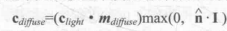
2. 公式需要四个参数：入射光线的颜色和强度Clight，材质的漫反射系数Mdiffuse，表面法线n，光源方向I。
3. max是防止点积结果为负值，CG提供了这样的函数 saturate(x)（用于将标量或矢量截取在[0,1]范围内）。

Unity中实现漫反射

1. 学习工程中：Chapter6,Scene_6_4,  Shader:DiffuseVertexLevel
2. **_Diffuse.rgb 是一个数值吗，表示什么**，\_LightColor0.rgb*\_Diffuse.rgb是什么算式

### 6.5 在Unity Shader中实现高光反射光照模型

高光发射公式

1. 高光反射的计算公式：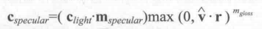
2. 需要四个参数：入射光线的颜色和强度Clight，材质的漫反射系数Mspecular，视角方向V以及反射方向r。反射方向r可以有表面法线n和光源方向I计算而得：CG提供了计算反射方向的函数，reflect(i,n)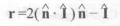
3. 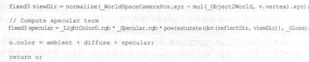
4. 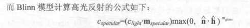
5. BlinnPhong模型代码：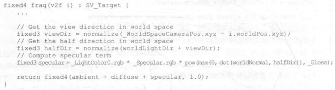

### 6.6 召唤神龙：使用Unity 内置的函数

1. 上面计算中需要计算光源方向、视角方向这两个基本信息，而在复杂的光照模型下，那个计算方式是错误的。

## 第七章 基础纹理

1. 纹理的最初目的是用一张图片来控制模型的外观。
2. 使用纹理映射计数，可以把一张图黏在模型表面，逐像素地控制模型的颜色。
3. 美术人员在建模软件中，把纹理映射坐标(定义顶点在纹理中对应得2D坐标，使用二维变量(u,v)来表示)存储在每个顶点上。
4. 纹理大小可以多种多样，纹理坐标的范围通常被归一到[0,1]的范围。但纹理采样时使用的纹理坐标不一定在[0,1]内，受采样方式控制，比如循环采样。
5. 在Unity中，纹理空间符合OpenGL传统，左下角为原点（0,0）

### 7.1 单张纹理

1. 将纹理带入片元着色器的颜色计算：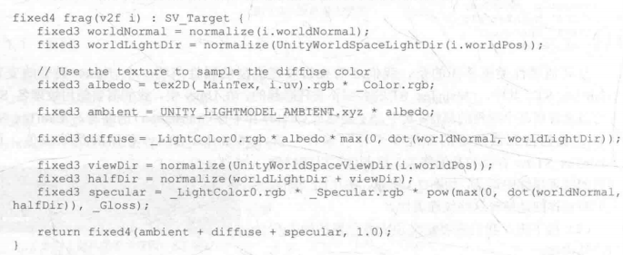
2. Filter Mode：决定了由于变换而产生拉伸时采用的滤波模式，Point，Bilinear，Trilinear效果依次提升，但耗费性能依次增大。Point模式会感觉有像素风。

### 7.2 凹凸纹理

目的是使用一张纹理来修改模型表面的法线，以便为模型提供更多的细节，让模型看起来好像是凹凸不平的。

两种主要方式：高度纹理和法线纹理

#### 高度纹理

1. 高度纹理来模拟表面位移，得到一个修改后的法线值，这种方法也称为高度映射
2. 高度图存储的是强度值，表示模型表面局部的海拔高度，颜色越浅表面该位置越向外凸起。
3. 好处是非常只管，缺点是更加复杂，计算时不能直接得到表面法线，而是需要由像素的灰度值计算。
4. 高度图通常和法线映射一起使用，通常会使用法线映射来修改光照。

#### 法线纹理

1. 使用法线纹理来直接存储表面法线，又称为法线映射。
2. 分为模型空间的法线纹理和切线空间的法线纹理。切线空间的优点是自由度很高、可进行UV动画(移动UV坐标来实现一个凹凸移动的效果，在水或者火山熔岩这种物体上经常用到)、可重用，可压缩
3. 大多数时候都是使用的切线空间的法线纹理。纹理看起来没有模型的形状就是切线空间的。

#### 实践

1. 切线空间下的计算：_BumbMap表示法线贴图，\_BumbScale表示凹凸程度。
2. 实际代码有点复杂，**先不看了**
3. 世界空间下的计算：也复杂，**先不看了**
4. **去看看公司里面的Shader**

#### Unity中的法线纹理类型

1. 贴图类型选择NormalMap。因为Unity内部会进行压缩和解压缩。当进行纹理采样时使用的Unity内置的UnpackNormal函数，实际就是针对压缩格式进行正确的采样。
2. CreateFromGrayscale选项：用于从高度图中生成法线纹理的，高度图本身就是一张灰度图。勾选后出现的选项Bumpiness控制凹凸程度，Filtering觉得使用那种凡是计算凹凸成都。

### 7.3 渐变纹理

1. **可以用来实现一些卡通化效果。**

2. 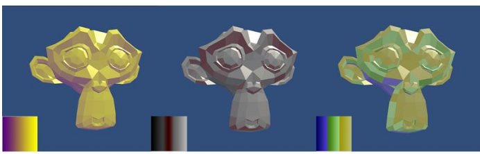

   

3. 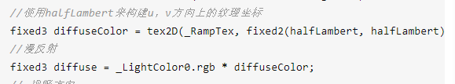

4. 和上面的法线贴图使用都差不多，要不是算出一个颜色乘到diffuse的计算，要不是乘到specular的计算里面。

5. 成品效果可能出现小黑点的话：可能是WrapMode为Repeat时，浮点数精度的原因，改为Clamp就好了。

### 7.4 遮罩纹理

1. 是把遮罩纹理的值乘到specular上面，主要用来控制高光。
2. 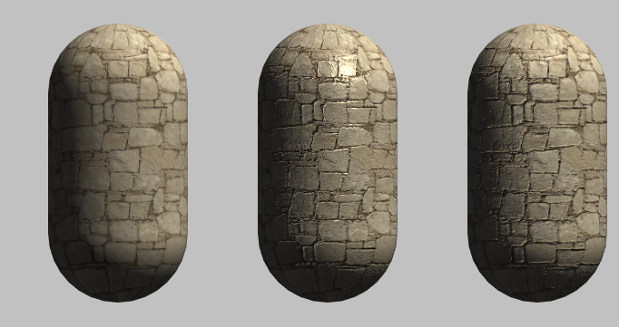

## 第八章 透明效果

实现透明效果，通常是在渲染模型时控制它的透明通道。

1. 使用透明度测试：该种方法无法得到真正的半透明效果
2. 使用透明度混合。

使用深度缓冲时，可以不关心不透明物体的渲染顺序。但是使用透明度混合时，需要关闭深度写入。

1. 透明度测试：只要一个片元的透明度不满足条件，那么它对应的片元就会被舍弃。
2. 透明度混合：这种方法可以得到真正的半透明效果。它会使用当前片元的透明度作为混合因子，与已经存储在颜色缓冲中的颜色值进行混合。混合需要关闭深度写入。但没有关闭深度测试，也就是说，对于透明度混合来说，深度缓冲是只读的。

### 8.1 为什么渲染顺序很重要

1. 因为渲染透明效果时，需要关闭深度写入，所以如果先渲染了位于更近的半透明物体，后渲染更远处的不透明物体，那么不透明物体就会把更近的半透明物体遮住，这肯定不对。
2. 并且单纯的依靠远近来渲染物体也不对，因为远近是像素级别的，而一个物体和另一个物体可能存在交叉，比如一部分在前面，一部分在后面。

### 8.2 Unity Shader的渲染顺序

Unity为了解决渲染顺序的问题提供了渲染队列这一解决方案。可以使用SubShader的Queue来决定我们的模型将归于哪个渲染队列。Unity内部使用了一系列整数索引来表示每个渲染队列，索引号越小，越早被渲染。Unity5中，Unity提前定义了5个渲染队列。

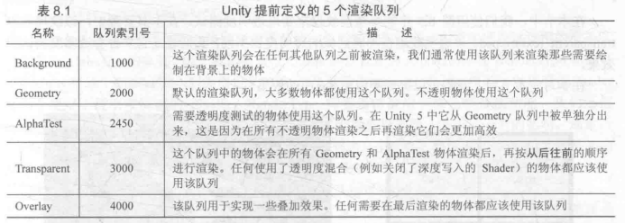

1. 通过透明度测试实现透明效果，设置Queue的代码：Tags{“Queue” = “AlphaTest”}
2. 通过透明度混合实现透明效果，Tags{"Queue" = "Transparent"}  Pass{ZWrite off}

### 8.3 透明度测试

1. 一个片元的透明度不满足条件(通常是小于某个阈值)，那么它对应的片元就会被舍弃。否则就会按照普通的不透明物体的处理方式来处理他。
2. clip函数：在片元着色器中，会判断他的参数，如果为负数，就会舍弃该片元的输出。clip(texColor.a - _CutOff)
3. 透明度测试得到的透明效果很“极端”，要么完全透明，要么完全不透明，效果往往像在一个不透明物体上挖了一个空洞。

### 8.4 透明度混合

1. 这种方法可以得到真正的半透明效果，会使用当前片元的透明度作为混合因子，与缓冲中的颜色值进行混合。
2. Unity提供的混合命令：Blend，混合时使用的函数。
3. 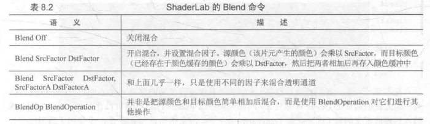
4. shader 标签设置：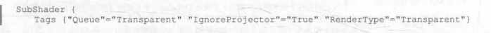
5. Pass中设置合适的混合状态：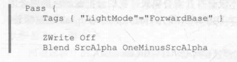
6. 片元着色器中正常计算颜色，并且返回的颜色中要设置透明通道，然后就会自动进行混合：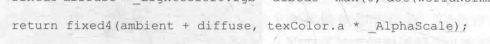
7. 这种当模型本身有复杂的遮挡关系或包含了复杂的非凸网格的时候，会出现排序错误而产生的错误的透明效果。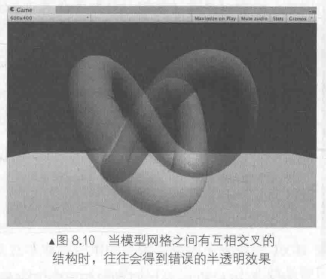

### 8.5 开启深度写入的半透明效果

什么使用两个pass来渲染啥的。后面再看

## 第九章 更复杂的光照

### 9.1 Unity的渲染路径

1. 渲染路径(Rendering Path)决定了光照是如何应用到Unity Shader的。
2. [manual](https://docs.unity3d.com/Manual/RenderingPaths.html)：一个渲染路径就是一系列与光照和渲染相关的操作，不同的路径能力和性能不同。
3. 大多数情况，一个项目只使用一种渲染路径：Edit -> Project Setting -> Plaayer -> Other Setting -> Rendering Path可以为整个项目设置渲染路径。默认是前向渲染路径。
4. 可以在摄像机设置自己的渲染路径，以覆盖projectsetting中的路径。
5. 如果显卡不支持当前渲染路径，会自动选择低一级的渲染路径。
6. 每个Pass需要设置一个标签，表明使用的渲染路径中的哪一种。Tags{"LightMode" = "ForwardBase"}。这个标签和上面的渲染路径不一样。每个渲染路径可能对应一个或多个标签。**如果指定的标签和摄像机的渲染路径不匹配怎么办？就不渲染了吗？**
7. 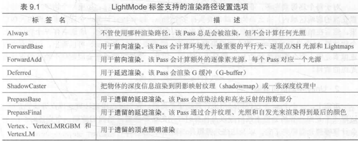

#### 9.1.1 前向渲染路径

逐像素光照与逐顶点光照：

1. 逐顶点光照：在vertex shader中为每个顶点计算一次光照颜色，然后通过顶点覆盖的区域对颜色进行线性插值得到某个像素的颜色。对于多边形镶嵌较高的模型来说够好了，但是对于多边形较少的模型来说就不一定，渲染出来棱角分明，高光效果不理想，插值结果也不够精确。
2. 逐像素光照：在PixelShader中，对所有光照元素进行单独插值，然后在逐个计算像素的颜色。可以在渲染时通过bump map或normal map添加并不存在的表面细节，表现凹凸效果。但是计算量更大。

前向渲染路径的原理：

1. 每进行一次完整的前向渲染，都需要渲染该对象的渲染图元，并计算颜色缓冲区和深度缓冲区的信息。
2. 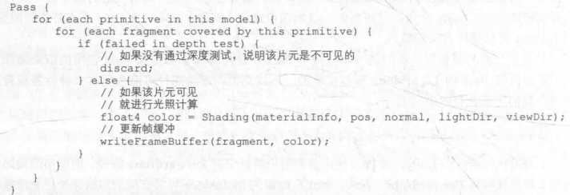
3. 对于每个逐像素光源，都需要进行上面一次完整的渲染流程。如果一个物体受多个光源影响，那么就需要执行多个Pass，每个Pass计算一个光照结果，然后在帧缓冲中混合。如N个物体受M个光源影响，就需要N*M个Pass。

Unity中的前向渲染：

1. 前向渲染路径有三种处理光照的方式：逐顶点处理，逐像素处理，球谐函数(SH)处理.
2. 决定一个光源使用那种模式取决于它的类型和渲染模式：类型是指是平行光还是其他，渲染模式是指该光源是否是**重要的**（设置为Important）。
3. 在前向渲染中渲染一个物体时，Unity会根据各个光源的设置以及对物体的影响程度(如距离物体的远近，光源强度等)对这些光源进行重要度排序，其中一定数目的光源按照逐像素处理，最多4个按照逐顶点处理，其他按SH处理，判断规则如下：
   * 场景中最亮的平行光总是按逐像素处理
   * 渲染模式被设置成Not Important的，按逐顶点或SH处理
   * 设置为Important的，按逐像素处理
   * 如果以上规则得到的逐像素光源数量小于Quality Setting中逐像素光源数量，会有更多的光源以逐像素方式进行处理。
4. 前向渲染有两种用来进行光照计算的Pass：Base Pass 和Addtional Pass，标签，渲染设置以及常规光照计算如图：
   * 
   * 上图渲染设置中的`#pragma multi_compile_fwdbase`和`pragma multi_compile_fwdadd`,官方文档无说明，但是必须使用这两个编译指令，才能在Pass中得到正确的光照变量，如光照衰减值等。
   * BasePass旁边注释给出了支持的光照特性，如可以访问光照纹理(lightmap)。
   * BasePass中渲染的平行光默认支持阴影，而Additional Pass默认没有，需要修改编译指令。
   * 环境光和自发光也是在BasePass中计算。
   * 在AdditionalPass中开启和设置了混合模式：因为希望每个Additional Pass 可以与上一次光照结果在帧缓冲中进行叠加，从而得到有多个光照的渲染效果。如果没有开启，那么Additional Pass的渲染结果会覆盖掉之前的渲染结果。
   * 通常只需要一个Base Pass 以及一个Additional Pass。

内置的光照变量和函数：

1. 根据我们使用的渲染路径（Pass标签中的LightMode的值），Unity会把不同的光照变量传递给Shader
2. 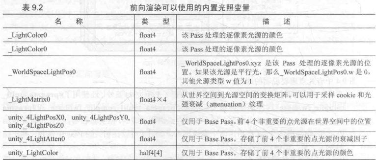
3. 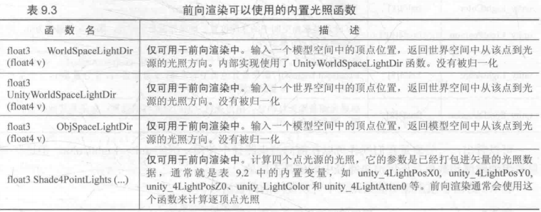

#### 9.1.2 顶点照明渲染路径

1. 对硬件配置要求最少，运算性能最高，但是效果最差。不支持逐像素才能得到的效果，如阴影、法线映射、高精度的高光反射等。实际上他是前向渲染的一个子集。如名，这个渲染路径只是使用了逐顶点的方式来计算。
2. 通常在一个Pass中就可以完成对物体的渲染。未来版本中，可能会被移除。

#### 9.1.3 延迟渲染路径

描述：

1. 前向渲染的问题：当场景中包含大量实时光源时，性能会急速下降。
2. 延迟渲染时更古老的方法：除了前向渲染使用的颜色缓冲和深度缓冲，还会利用额外的缓冲区，统称为G缓冲(G-buffer)，G为Geometry，存储了我们所关心的表面(通常至离摄像机最近的表面)的其他信息，如表面的法线、位置、用于光照计算的材质属性等。

原理：

1. 主要包含两个Pass，第一个Pass中不进行光照计算，仅仅计算哪些片元可见，主要通过深度缓冲技术实现，当片元可见，则把它的相关信息存储到G缓冲中。第二个Pass利用G-buffer中的信息进行计算。
2. 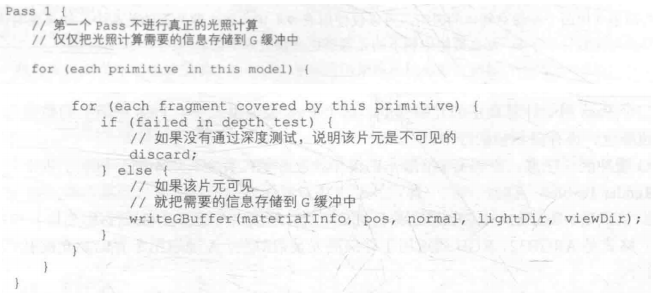
3. 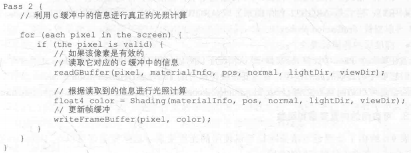
4. 延迟渲染的Pass数目就是两个，这跟场景中包含的光源数目是没有关系的，即效率不依赖场景复杂的，而是屏幕空间的大小有关。

Unity中的延迟渲染：

1. 适合在场景中光源数目很多，使用前向渲染会造成性能瓶颈的情况下使用。
2. 延迟渲染中每个光源都可以按逐像素的方式处理。
3. 不支持真正的抗锯齿功能，不能处理半透明物体，对显卡有一定要求，显卡必须支持MRT(Multiple Render Targets)、Shader Mode 3.0以上、深度渲染纹理以及双面的模板缓冲。
4. 默认的G-buffer包含了以下几个渲染纹理：
   * RT0：格式是ARGB32，RGB通道用于存储漫反射颜色，A没有被使用
   * RT1：格式是ARGB32，RGB用于存储高光反射颜色，A存储高光反射的指数部分。
   * RT2：格式是ARGB2101010，RGB存储法线，A未使用。
   * RT3：ARGB32（非HDR）或ARGBHalf（HDR），用于存储自发光+lightmap+反射探针
   * 深度缓冲和模板缓冲。
5. 可访问的内置变量和函数：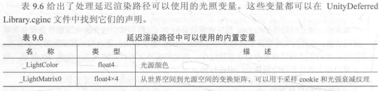

#### 9.1.4 选择哪种渲染路径

看manual给出的4中渲染的详细比较，包括特性，性能以及平台支持。[https://docs.unity3d.com/Manual/RenderingPaths.html](https://docs.unity3d.com/Manual/RenderingPaths.html)

1. 前向渲染对于实时光照比较费，可以设置逐像素渲染的光照数量。因为每个光照都会单独进行Pass的计算。
2. 延迟渲染需要GPU的一些支持，并且有一些限制：不支持半透明物体，不支持抗锯齿，不支持orthographic projection。

### 9.2 Unity的光源类型

简单看一下，有空再细看

Unity支持：平行光，点光源，聚光灯和面光源。面光源仅在烘焙时才发挥作用。

光源类型的影响，主要是五个方面，也是光源的五个属性：位置，方向，颜色，强度，衰减

平行光：可以改变光源方向，但是对于每个点，光源方向都是一样的，没有衰减的概念。强度不会随距离变化

点光源：照亮空间有限，由空间中的一个球体定义，会随着物体逐渐原理点光源，光照强度会逐渐较小。球心处光照强度最强，球体边界处最弱。

聚光灯：由空间中一块锥形区域定义。表示有一个特定位置出发，向特定方向延伸的光。

#### 9.2.2 在前向渲染中处理不同的光源

### 9.3 简单看一下

### 9.4 Unity的阴影

学习如何在Unity中让一个物体向洽谈物体投射阴影，以及如何让一个物体接收来自其他物体的阴影。

#### 9.4.1 阴影是如何实现的

实时渲染中，最常用的是名为Shadow Map的技术。就是把摄像机放在与光源重合的位置上，那么场景中该光源的阴影区域就是那些摄像机看不见的地方。Unity就是使用的这种技术。

前向渲染中，如果场景中最重要的平行光开启了阴影，Unity就会为该光源计算它的阴影映射纹理(shadowmap)，这纹理本质上是一张深度图，记录了从该光源的位置触发，能看到的场景中距它最近的表面位置(深度信息)。因此，每个开启了阴影的光源都会有一张shadowmap；

Unity的实现：

1. 使用一个额外的Pass来专门更新光源的shadowmap，这个Pass就是LightMode标签设置为ShadowCaster的Pass。
2. 该pass的渲染目标不是帧缓冲，而是阴影映射纹理(或深度纹理)。
3. 首先Unity把摄像机放到光源位置上，然后调用该Pass，对顶点变换后得到光源空间下的位置，并据此来输出深度信息到阴影映射纹理中。
4. 当开启光源的阴影效果后，底层渲染引擎会在当前渲染物体的Shader中找目标Pass，没有则会在Fallback指定的Shader中找，如果没找到，则无法想其他物体投射阴影，当找到后，则使用该panss来更新shadowmap。
5. 最后在正常渲染的Pass中将顶点位置变换到光源空间下，得到它在光源空间的三维位置信息，然后对阴影映射纹理进行采样，得到shadowmap中该位置的深度信息，如果深度值小于顶点的深度值，就说明该店位于阴影中。
6. Unity使用了不同的阴影采样技术：屏幕空间的阴影映射技术，并不是所有平台都使用这种技术，这种技术需要显卡支持MRT。其实就是最终采样的shadowmap不同，一个是光源的深度纹理，一个是屏幕空间的阴影图。
   1. 首先会通过pass得到两张深度纹理，光源的深度纹理（相当于光源空间下）和摄像机的深度纹理(相当于摄像机空间下，这个摄像机应该是实际渲染的摄像机而不是拿来采集光源深度纹理的摄像机)。
   2. 通过两张纹理来得到屏幕空间的阴影图，包含了屏幕空间中所有有阴影的区域。原理是：如果摄像机深度纹理记录的深度值大于转换到阴影映射纹理中的深度值，则说明该点可见，但处于阴影中。
   3. 顶点计算时，将顶点转换到屏幕空间，对屏幕空间阴影图采样，就得到了该点是否在阴影中。
7. 总结一下一个物体接收来自其他物体的阴影，以及向其他物体投射阴影的两个过程
   1. 一个物体接收来自其他物体的阴影：就必须在Shader中对阴影映射为那里进行采样，把采样结果和最后的光照结果相乘来产生阴影效果。
   2. 一个物体向其他物体投射阴影：必须把该物体加入到光源的阴影映射纹理计算中，从而让其他物体在对shadowmap采样时可以得到该物体的相关信息。Unity中，这个过程通过为该物体执行LightMode为ShadowCaster的Pass来实现。如果使用屏幕映射技术，Unity还会使用这个Pass产生一张摄像机的深度纹理 。

#### 9.4.2 实践不透明物体的阴影

投射与接收阴影

1. 开启光源的阴影效果，在Light组件中设置ShadowType。
2. 设置MeshRenderer组件的CastShadow和ReceiveShadow.  Cast表示是否让物体执行ShadowCaster的Pass的技术。Receive表示，计算渲染时是否对shadowmap采样。
3. 使用Fallback提供的ShadowCaster的Pass，或者在SubShader中定义自己的Pass。
4. CastShadow设置为TwoSided来允许对物体的所有面都计算阴影信息。
5. 接收阴影时进行的计算。
   * SHADOW_COORDS在vertexshader输出结构中声明一个用于对阴影纹理采样的坐标
   * TRANSFER_SHADOW:在顶点着色器返回前使用来计算上一步中声明的阴影纹理坐标。
   * SHADOW_ATTENUATION:在片元着色器中计算阴影值。

#### 9.4.3 使用FrameDebugger查看阴影渲染的过程

其中RenderShadowmap就是渲染得到平行光的阴影映射纹理

CollectShadows：根据深度纹理和阴影映射纹理得到屏幕空间的阴影图。

#### 9.4.4 同一管理光照衰减和阴影

#### 9.4.5 实践透明物体的阴影

不透明物体：把Fallback设为VertexLit就可以得到正确的阴影。

透明物体需要对阴影进行透明度测试，所以需要选择一个有透明度测试功能的Pass。可以自己写，也可以把Fallback设置为Transparent/Cutout/VertexLit,因为这个shader计算透明度测试时使用了名为_Cutoff的属性，因此我们的Shader也必须提供同名的属性。

## 第10章 高级纹理

### 10.1 立方体纹理

是环境映射的一种实现方法：环境映射可以模拟物体周围的环境，而使用了环境映射的物体可以看起来像渡了层金属一样反射出周围的环境。

立方体纹理包含了6张图像，每张就是立方体的一个面，表示沿着世界空间下的轴向(上下左右前后)观察得到的图形。

对立方体纹理的采样：需要一个三维的纹理坐标，这个纹理坐标表示在世界空间下的一个3d坐标。这个方向从立方体中心出发，向外部延伸时就会和立方体的6个纹理之一发生相交，而采样得到的结果就是由该交点计算而来。

#### 10.1.1 天空盒子

在场景中使用了天空盒子时，整个场景就被包围在一个立方体内。

#### 10.1.2 创建用于环境映射的立方体纹理

#### 10.1.3 反射

实现：通过入射光线的方向和表面法线方向来计算反射方向，再利用反射方向对立方体纹理采样即可。

#### 10.1.4 折射

### 10.2 渲染纹理

一个摄像机的渲染结果会输出到颜色缓冲中，并显示到屏幕上。而现代GPU允许把整个三维场景渲染到一个中间缓冲中，及**渲染目标纹理(Render Target Texture,RTT)**，与之相关的技术叫多重渲染目标，MRT。延迟渲染就是使用多重渲染目标的一个应用。

Unity中为RTT定一个一种专门的纹理类型：RenderTexture。使用这种纹理有两种方式：

1. 在Project下创建，然后设置摄像机渲染到RenderTexture。
2. 在屏幕后处理时使用GrabPass命令或在OnRenderImage函数中获取当前屏幕图像，Unity会把屏幕图像放到一张和屏幕分辨率等他的渲染纹理中。可以在在定义的Pass中把它们当成普通的纹理来处理，实现各种屏幕特效。

#### 10.2.1 镜子效果

1. 创建一个摄像机将物体渲染到纹理。
2. 在镜子物体上显示这个纹理(纹理设置给MeshRender),并在Shader中翻转x分量的纹理坐标。

#### 10.2.2 玻璃效果

UnityShader中使用一种特殊的Pass来完成获取屏幕图像的目的：GrabPass。只需要在我们正常的pass前面加上一个GrabPass{}就可以了，unity为我们实现好的。

在Shader中定义后，Unity会把当前屏幕的图形回执在一张纹理中，以便我们再后续的Pass中访问。

可以实现诸如玻璃等透明材质的模拟，与简单的透明混合不同，GrabPass可以让我们对该物体后面的图形进行更复杂的处理，例如使用法线来模拟折射效果。

#### 10.2.3 渲染纹理 Vs GrabPass

Grabpas 更简单，但是效率更低。需要CPU直接读取后备缓冲中的数据，破坏了CPU和GPU的并行性。

渲染纹理可以指定渲染纹理的大小，但是需要把部分场景再次渲染一遍。

### 10.3 程序纹理

程序纹理(Procedural Texture)指的是那些由计算机生成的纹理。

使用一些特定的算法来创建个性化图案或非常真实的自然元素，如木头、石子。

c#代码中可以生成。声明材质，设置材质。

## 第11章 让画面动起来

本章，学习如何向Shader中引入时间变量，来模拟各种动画效果。

### 11.1 Unity Shader中的内置变量(时间)

内置变量以在Shader中访问运行时间，实现各种动画效果。

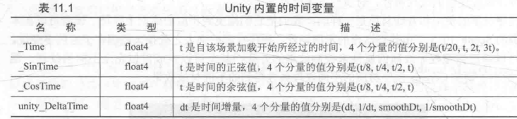

### 11.2 纹理动画

在移动平台，可以使用纹理动画来代替复杂的粒子系统等模拟动画效果。我们新项目的部队的角色动画，就是纹理动画吧。

序列帧动画：

1. 原理是依次播放一系列关键帧图像，当速度达到一定值时，看起来就是一个连续的动画。
2. 首先需要一张包含了关键帧图像的图像。
3. Shader中提供水平方向，垂直方向关键帧数量，以及播放速度的参数，以便在外部设置
4. 获取当前时间，从而计算当前需要播放的关键帧在纹理中的位置(可以认为是该关键帧所在的行列索引数)。
5. 使用行列索引值来构建采样坐标。
6. 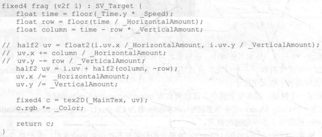
7. i.uv中xy存储的是tilling，默认就是(1,1)，zw存储的是offset（0,0）。
8. 首先把i.uv按行数和列数进行等分，得到子图像的纹理坐标范围，然后使用当前行数和列数进行偏移。

无限滚动的背景：

1. 和上面那个差不多吧，使用_Time.y在水平方向上对纹理坐标进行偏移，以达到滚动的效果。
2. 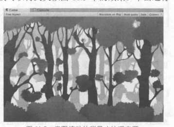

### 11.3 顶点动画

####  11.3.1 流动的河流

原理是使用正弦函数来模拟水流的波动效果。

1. 首先是几个参数：都是float，\_Magnitude控制波动幅度，\_Frequency控制波动频率，\_InvWaveLength控制波长的倒数，\_Speed控制河流纹理的移动速度。_MainTex是河流纹理.
2. 具体的算法就不看了。

#### 11.3.2 广告牌

**广告牌技术**会根据视角方向来渲染一个被纹理着色的多边形，是多边形看着好像总是面对着摄像机。这个技术被用于很多应用，比如渲染烟雾、云朵、闪光效果等。

该技术本质是构建旋转矩阵，一个变换矩阵需要3个基向量，在广告牌技术中使用的就是 表面法线，指向上的方向，指向右的方向。除此之外，还需要一个锚点，这个锚点在旋转过程中不变，以此来确定多边形在空间的位置。

#### 11.3.3 注意事项

1. 如果在模型空间下进行顶点动画，那么批处理会破坏这种动画效果，可以通过SubShader的DisableBatching标签来强制取消。
2. 对包含了顶点动画的物体添加阴影，仍然想9.4那样使用内置的Diffuse等包含的阴影Pass来渲染，就不能得到正确的效果。因为阴影计算的Pass并没有进行顶点动画，那么得到的点和实际顶点动画后的顶点就不同。

## 第12章 屏幕后处理效果

游戏中实现屏幕特效的常见方法。如名，通常指在渲染完整个场景得到屏幕图像后，在对这个图像进行一系列操作，实现屏幕特效，如景深，运动模糊。

### 12.1 建立一个基本的屏幕后处理脚本系统

1. 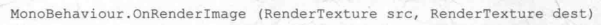
2. src指当前渲染后得到的纹理，dest是经过处理后要显示到屏幕上的纹理
3. 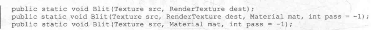
4. 使用Graphics.Blit来完成对渲染纹理的处理，函数会把src作为_MainTex传递到mat使用的shader，并执行索引为Pass的Pass(默认为-1，表示执行所有Pass)。
5. 默认情况，OnRenderImage函数在所有的不透明和透明的Pass执行完毕后调用。可以在函数前添加ImageEffectOpaque属性来指定在不透明Pass（即渲染队列小于等于2500）渲染后就立即调用。
6. 一般使用，是在摄像机中添加一个屏幕后处理的脚本，在脚本中使用OnrenderImage来获取当前屏幕的纹理，然后使用Graphics.Blit来处理。
7. 使用前需要先判断是否能使用：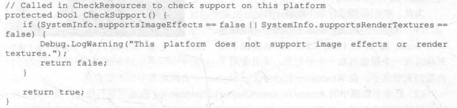

#### 12.2 调整屏幕亮度、饱和度和对比度

1. 在脚本中创建材质：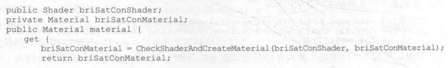
2. 在脚本中设置材质的参数：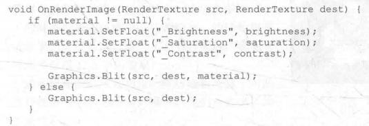
3. 在shader中应用参数：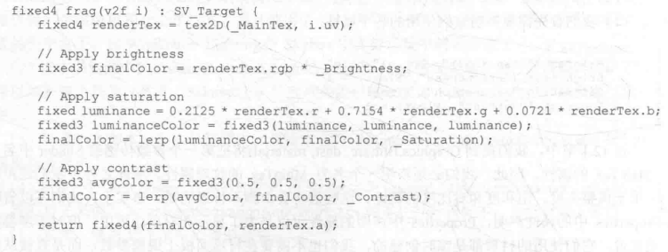

#### 12.3 边缘检测

实现描边效果的一种方法。原理是利用一些边缘检测算子对图像进行卷积操作。

#### 12.4 高斯模糊

也是使用卷积来实现。

#### 12.5 Bloom 效果

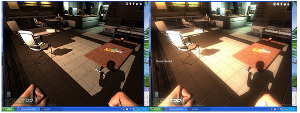

又称全屏泛光。让画面中较亮的区域扩散到周围的区域中，看起来朦胧。亮的地方曝光会加强，呈现出一种朦胧梦幻的效果。

原理：首先根据一个阈值提取出图像中的较亮区域，存储在一张渲染纹理中，再用高斯模糊对这张纹理进行模糊处理，模拟光线扩散的效果，最后再将其和原图像进行混合，得到效果。

#### 12.6 运动模糊

运动模糊的身影。一种实现方式是利用一块累积缓存。

## 第13章 使用深度和法线纹理

基于屏幕后处理的全局雾效实现：关键是根据深度纹理来重建每个像素在世界空间下的位置。

## 第14章 非真实感渲染

游戏渲染一般都是以照相写实主义作为主要目标，但也有许多游戏使用非真实感渲染。

主要目标是：使画面达到和某些特殊的绘画风格相似的效果，例如卡通，水彩。

卡通风格的渲染：

1. 基于色调的着色技术
2. 渲染轮廓线
3. 添加高光

## 第15章 使用噪声

向规则的事物添加一些“杂乱无章”的效果往往会有意向不到的效果。这些杂乱无章的效果来源就是噪声。

### 15.1 消融效果

消融效果（dissolve）常见于游戏中的角色死亡、地图烧毁等效果。原理就是噪声纹理+透明度测试。使用噪声纹理采样的结果和某个控制消融程度和阈值比较，如果小于，就使用clip函数把它对应得像素裁剪掉，这些部分就对应了被“烧毁”的区域。而镂空边缘的烧焦效果则是将两种颜色混合，再使用pow函数处理后，与原纹理颜色混合。

### 15.2 水波效果

噪声纹理通常会用作一个高度度，以不断修改睡眠的法线方向。模拟水不断流动的效果，会使用时间相关的变量对噪声纹理进行采样。

## 第16章 Unity中的渲染优化技术

游戏优化不仅仅是程序员的工作，更需要美术人员在游戏的美术上进行一定的权衡，比如避免使用全屏的屏幕特效，避免使用复杂计算的Shader，减少透明混合造成的overdraw等。

### 16.1 移动平台的特点

移动设备的GPU专注于尽可能使用更小的带宽和功能。例如为了尽可能移除那些隐藏的表面，减少overdraw，Power_VR通常使用了基于瓦片的延迟渲染。另一些比如Adreno，使用了Early-Z技术来进行一个低精度的深度检测来提出那些不需要渲染的片元。

### 16.2 影响性能的因素

对于游戏，主要使用两种计算资源：CPU和GPU。CPU主要负责保证帧率，GPU主要负责和分辨率相关的一些处理。游戏性能瓶颈主要原因如下：

CPU：

1. 过多的draw call ：因为cpu要准备顶点数据(位置，法线，颜色等)。而每次调用drawcall基本上要改变渲染状态。
2. 复杂的脚本或者物理模拟
3. 优化：使用批处理计数来减少drawcall数目

GPU：

1. 顶点处理（过多顶点，过多逐顶点计算），
2. 片元处理（过多片元，过多逐片元计算）
3. 优化1：减少需要处理的顶点数目（优化几何体，使用模型的lod计数，使用遮挡提出计数）
4. 优化2：减少需要处理的片元数目（控制绘制顺序，警惕透明物体，减少实时光照）

带宽：

1. 使用了尺寸很大且未压缩的纹理，分辨率过高的帧缓存。
2. 优化：减少纹理大小，利用分辨率缩放。

### 16.3 Unity中的渲染分析工具

渲染统计窗口：就是game试图的status

1. Batches：一帧中需要进行的批处理数目

2. 没帧的时间和FPS

3. Saved by batching：合并的批处理数目，表明了批处理为我们节约了多少drawcall

4. Tris和Verts：需要绘制的三角面片和顶点数目。

5. Screen：屏幕的大小以及它占用的内存带下

6. SetPass：渲染使用的Pass的数目，每个Pss都需要Unity得runtime来绑定一个新的Shader。

7. Visible Skinned Meshes：渲染的蒙皮网格的数目

8. Animations：播放的动画数。

性能分析器：就是analysis里面的render部分

帧调试器：FrameDebugger		

Batch 和 Drawcall的区别

1. Batch表示：表示一次渲染批次，包括设置渲染状态(材质、顶点数据)，调用drawcall绘制。一个batch必然会触发一次或多次drawcall。
2. drawcall：一次渲染命令的调用，Cpu每次调用图像编程接口glDrawElements都认为是一个drawcall，它指向一个需要被渲染的图元列表，不包含任何材质信息，而函数的作用就是将cpu准备好的数据渲染出来。

### 16.4 减少drawcall数目

批处理技术（batching）：

1. 原理就是较少每一帧需要的drawcall数目。
2. 思想就是每次面对drawcall时尽可能地多处理对象。
3. 可以放在一起处理的对象：使用同一个材质的物体。（这时他们的差异就仅仅在于顶点数据的差异，把这些顶点数据合并在一起，再一起发送给GPU，就可以完成一次批处理）。

动态批处理：

1. 如果场景中的一些模型共享了同一个材质并满足一些条件，Unity就可以自动把他们进行批处理，从而只花费一个drawcall就可以渲染所有模型。
2. 过程是：每帧把可以批处理的网格进行合并，再把合并后的模型数据传递给GPU，然后使用一个材质对其渲染。经过动态批处理的物体仍然可以移动，因为每一帧Unity都会重新合并一次网格。
3. 条件1：网格的顶点属性规模要小于900。例如，如果Shader中使用顶点位置、法线、纹理这3个顶点属性，那么要想让模型能被批处理，那么顶点数就不能超过300.
4. 条件2：一般来说，所有对象都需要使用同一个缩放尺度。Unity5中，这个限制已经没有了。
5. 条件3：使用光照纹理的物体，这些物体需要额外的参数，比如在光照纹理上的所有，偏移量等，为了让这些物体能被批处理，需要保证他们指向光照纹理中的同一个位置。
6. 多Pass的shader会中断批处理。

静态批处理：

1. 实现原理：在运行开始阶段，把需要进行静态批处理的模型合并到一个新的网格结构中，这意味着这些模型不可以在运行时被移动。但只需要进行一次合并。
2. 静态批处理的物体往往需要更多的内存来存储合并后的几何结构。因为在静态批处理前，如果一些物体共享了相同的网格，那么内存中每一个物体都会对应一个改网格的复制品。比如场景中有1000棵树使用了统一网格，那么使用静态批处理，就会多1000倍的内存。
3. 但是静态批处理时，使用不同材质的物体还是不能合并drawcall。合并后的mesh下面会分成多个submesh。虽然不能合并drawcall，但是和合并状态设置，虽然调用多次drawcall，但是不用切换状态，也就是不用重新设置数据。
4. 合并处理后：性能分析器中VBO total(vertex buffer object,顶点缓冲对象)会变大，这正是因为静态批处理会占用更多内存的缘故。

共享材质：

1. 如果两个材质之间只是使用的纹理不同，可以把这些纹理合并到一张更大的纹理上面，这个纹理可以称为时一张图集。就可以使用同一个材质，使用不同的采样坐标进行采样即可。
2. 其他参数的一些微小差异：可以巧妙的使用VBO数据的传递来进行一些控制。

批处理的注意事项：

1. 尽可能使用静态批出来，但得小心内存。
2. 使用动态批处理要小心上面的限制
3. 对于游戏中的小道具，例如可以捡的金币等，可以使用动态批处理。
4. 如果有动画的物体，可以对不动的部分标记为“Static”

### 16.5 减少需要处理的顶点数目

尽管drawcall是一个重要的性能指标，但顶点数目同样有可能成为重要的性能瓶颈。

#### 16.5.1 优化几何体

尽可能减少模型中三角面片的数目，一些对模型没影响，或肉眼很难察觉的都要去掉。

#### 16.5.2 模型的LOD技术

lod允许摄像机逐渐远离摄像机时，减少模型上的面片数量，从而提升性能。

LODGroup组件：为一个物体构建一个LOD，需要为同一个对象准备多个包含不同细节程序的模型，然后设置给lodgroup组件中的不同等级。unity会自动判断当前位置需要使用哪个等级的模型。

#### 16.5.3 遮挡剔除技术

消除那些在其他物件后面看不到的物件。

遮挡剔除不同于摄像机剔除：摄像机剔除是剔除那些不在摄像机视野范围内的对象，而遮挡剔除是会判断视野中是否有物体被其他物体挡住。

工作原理：使用一个虚拟的摄像机遍历场景，从而构建一个潜在可见的对象几何的层次结构。运行时刻，每个摄像机都会使用这个数据来识别哪些物体是可见的，而哪些物体被其他物体挡住不可见。

### 16.6 减少需要处理的片元数目

另一个GPU瓶颈是需要处理过多的片元。这部分的重点在于减少overdraw（同一个像素被绘制了多次）。overdraw可以在Scene试图左上方的下拉列表中选择overdraw查看(显示互相遮挡的层数，而不是真正屏幕绘制的overdraw，即没有任何深度测试和优化策略时的overdraw)。

控制渲染顺序

1. 由于深度测试的存在，如果物体都是从前往后绘制的，那么那些位于后面的不能通过深度测试的就无须进行后面的处理。
2. 渲染队列数小于2500的被认为是不透明的，就一定会从前往后绘制。所以尽可能把物体的队列设置为不透明物体。
3. 充分利用Unity的渲染队列：如在FPS游戏中，游戏的主要人物角色shader比较复杂并常常会挡住屏幕很大一部分，所以可以先绘制它们(使用更小的渲染队列)。而对于天空盒子来说，肯定永远在最后面，所以队列可以设置为“Geometry + 1”。使用这种思想可以节省掉很多渲染时间。   意思就是我们可以利用游戏的玩法表现上的机制，对不同的模型使用不同的渲染队列来手动控制一些绘制顺序。

时刻警惕透明物体：

1. 半透明对象，由于没有开启深度写入，所以如果要得到正确的效果就必须从后往前渲染。所以几乎一定会造成overdraw。
2. 场景中包含大量的半透明对象时应该避免的。

减少实时光照和阴影：

1. 如果场景中包含了过多的点光源，并使用了多个Pass的shader，则很可能造成性能下降。
2. 场景需要很多光照来得到出色的画面效果，可以使用烘焙计数，把光照提前烘焙到一张lightmap中。

### 16.7 节省带宽

减少纹理大小：

1. 尽量使用长款值是2的整数幂。
2. 使用多级渐远纹理技术：Generate Mip maps。
3. 纹理压缩。

利用分辨率缩放：过高的屏幕分辨率会造成性能下降，尤其是一些手机，除了分辨率搞，其他硬件条件不尽如人意，可以使用Screen.SetResolution来调整。

### 16.8 减少计算复杂度

shader的Lod技术：

1. 可以控制使用的Shader等级，原理是只要Shader的LOD值小于某个设定的值，这个shader才会被使用。
2. 在SubSahder中直接使用LOD 200这样的方式来设定等级值。
3. 使用Shader.maximumLOD或Shader.globalMaximulLOD来设置允许的最大LOD值。

代码方面的优化

## 第17章 Unity的表面着色器探秘

表面着色器实际上是Unity在顶点/片元着色器之上的一层抽象。让开发者不需要考虑有场景中有多少光源，使用前向渲染路径还是延迟渲染路径。

这一章还讲了表面着色器的实际使用等等。真的学习的时候可以看看

## 第18章 基于物理的渲染

Physically Based Shading，PBS。

pbs 是为了对光和材质之间的行为进行更加真是的建模。

之前的Lambert光照模型，Phong和Blinn-Phong光照模型的缺点在于，都是经验模型，如果需要渲染更高质量的画面，这些就不能满足需求。

Unity引入了基于物理的渲染，不需要我们过多地了解PBS是如何实现的，就可以利用各种内置工具来实现一个不错的渲染效果。

## 第19章 Unity5更新了什么

## 第20章 没有更多内容吗

Unity Shader实际上是建立在OpenGL，DirectX这样更加基础的图形接口上的。

这些图形接口的一些参考书，OpenGL：红宝书(OpenGL编程指南)，蓝宝书(OpenGL超级宝典)。还有MiloYip的豆列。
